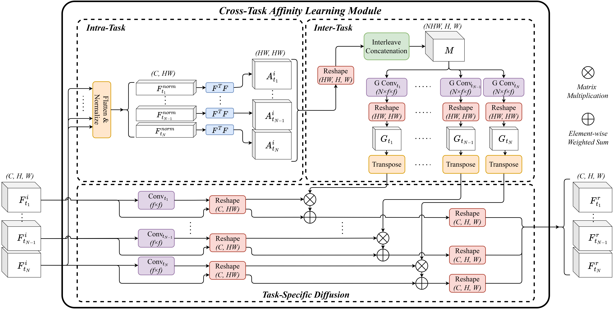

<div align="center">
  <h1>Cross-Task Affinity Learning for Multitask Dense Scene Predictions</h1>
</div>

This is the official PyTorch implementation of the paper:  
**"Cross-Task Affinity Learning for Multitask Dense Scene Predictions"** (WACV 2025).   


🔗 **[Preprint on arXiv](https://arxiv.org/abs/2401.11124)** 

CTAL enhances task refinement in multitask learning (MTL) by capturing both local and long-range cross-task interactions, improving performance for CNN and Transformer-based architectures.

## **🚀 Getting Started**
### **Setup the Environment**

To clone the repo and setup the environment, run:
```sh
git clone https://github.com/Dimitri-Sinodinos/CTAL.git
cd CTAL
conda env create -f environment.yml
conda activate ctal
```
### **Download Datasets**
Before running experiments, download (and extract) the datasets:
1. [NYUv2](https://www.dropbox.com/sh/86nssgwm6hm3vkb/AACrnUQ4GxpdrBbLjb6n-mWNa?dl=0)
2. [Cityscapes](https://www.dropbox.com/sh/gaw6vh6qusoyms6/AADwWi0Tp3E3M4B2xzeGlsEna?dl=0)
3. [PASCAL_Context](https://hkustconnect-my.sharepoint.com/:u:/g/personal/hyeae_connect_ust_hk/ER57KyZdEdxPtgMCai7ioV0BXCmAhYzwFftCwkTiMmuM7w?e=2Ex4ab)

### **Download Pretrained Weights**
For **CNN-based** models:
1. Download weights [HRNet-W18-C-Small-v2](https://github.com/HRNet/HRNet-Image-Classification).
2. Save them to ```code_cnn/models/pretrained_models/hrnet_w18_small_model_v2.pth```.

For **Transformer-based** models, the pretrained ```swin_v2``` backbones are dowloaded automatically with ```torchvision```.

## **🔧 Running Experiments**
We provide two implementations:
- **`code_cnn/`** → CNN-based code (supports Cityscapes, NYUv2) 
- **`code_transformer/`** → Transformer-based code (supports PASCAL_Context) 
### **Training the Model**
1. Enter the appropriate directory:
   ```sh
   cd code_cnn
   ``` 
   or
   ```sh
   cd code_transformer
   ```
2. Set the ```db_root``` (dataroot) in ```configs/mypath.py``` to where you stored the dataset.
3. Update `--storage_root` and `--config` in `train.sh`
4. Run:
   ```sh
   bash train.sh
   ```

## **📚 Citation**
If you use this code or find our work helpful, please cite:
```bibtex
@misc{sinodinos2024crosstaskaffinitylearningmultitask,
      title={Cross-Task Affinity Learning for Multitask Dense Scene Predictions}, 
      author={Dimitrios Sinodinos and Narges Armanfard},
      year={2024},
      eprint={2401.11124},
      archivePrefix={arXiv},
      primaryClass={cs.CV},
      url={https://arxiv.org/abs/2401.11124}, 
}
```

## **📖 Abstract**
> Multitask learning (MTL) has become prominent for its ability to predict multiple tasks jointly, achieving better pertask performance with fewer parameters than single-task learning. Recently, decoder-focused architectures have significantly improved multitask performance by refining task predictions using features from related tasks. However, most refinement methods struggle to efficiently capture both local and long-range dependencies between task-specific representations and cross-task patterns. In this paper, we introduce the Cross-Task Affinity Learning (CTAL) module, a lightweight framework that enhances task refinement in multitask networks. CTAL effectively captures local and long-range cross-task interactions by optimizing task affinity matrices for parameter-efficient grouped convolutions without concern for information loss. Our results demonstrate state-of-the-art MTL performance for both CNN and transformer backbones, using significantly fewer parameters than single-task learning.

## **🛠️ Acknowledgment**
This repo borrows several elements from [Multi-Task-Learning-PyTorch](https://github.com/SimonVandenhende/Multi-Task-Learning-PyTorch) and [MTAN](https://github.com/lorenmt/mtan).